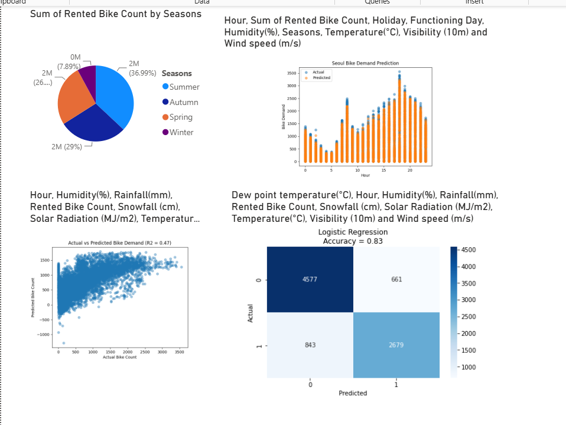
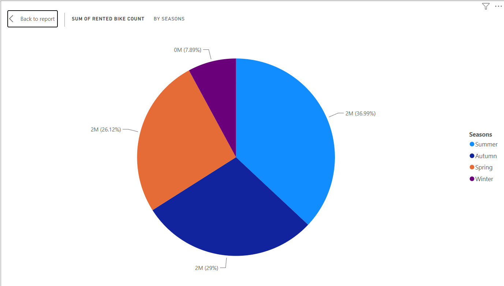
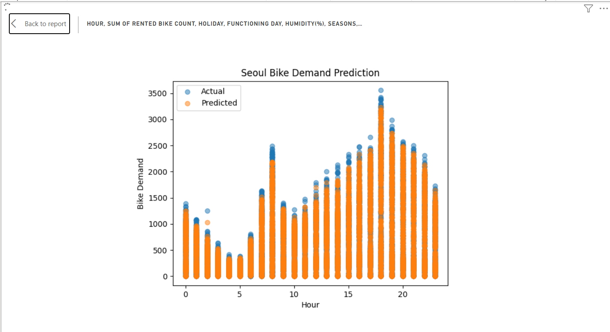
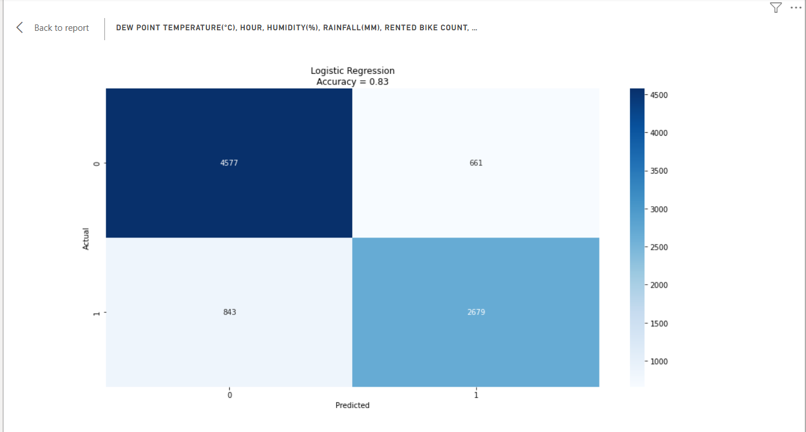

# Bike Demand Prediction System

## Team Members

* Deepak R (192511008)
* Vijay A (192511030)

## My Contributions (Deepak R)

I was responsible for the development and implementation of **Module 1 – Data Preprocessing**.

### Key Contributions

* Collected and prepared the Seoul Bike Sharing Demand dataset.
* Performed data cleaning and preprocessing to handle missing and inconsistent values.
* Encoded categorical variables such as Seasons, Holiday, and Functioning Day.
* Conducted exploratory data analysis to identify bike rental trends and patterns.
* Prepared datasets for machine learning model training and evaluation.
* Assisted in visualization development using Power BI.
* Supported project testing, validation, and documentation activities.

---

## Technologies Used

* Python
* Power BI
* Pandas
* Scikit-Learn
* Matplotlib
* Seaborn

---

## Features

* Data Cleaning and Preprocessing
* Seasonal Bike Demand Analysis
* Random Forest Regression
* Linear Regression Analysis
* Logistic Regression Classification
* Interactive Power BI Dashboard
* Bike Demand Forecasting
* Model Performance Evaluation
* Demand Trend Visualization

---

## Project Overview

The Bike Demand Prediction System is a machine learning and business intelligence project developed using the Seoul Bike Sharing Demand Dataset.

The project analyzes environmental and seasonal factors affecting bike rentals and applies machine learning algorithms to predict future bike demand. Power BI is used to visualize insights and present model outputs through an interactive dashboard.

The system helps identify demand patterns, evaluate prediction accuracy, and support data-driven decision-making for bike-sharing services.

---

## Machine Learning Models Used

### Random Forest Regression

Used to predict bike rental demand using weather conditions, seasonal factors, and operational variables.

### Linear Regression

Used to analyze the relationship between actual and predicted bike demand values and evaluate model performance.

### Logistic Regression

Used to classify demand levels into high-demand and low-demand categories for predictive analysis.

---

## Screenshots

### Bike Demand Analytics Dashboard

### Seasonal Bike Rental Distribution

### Random Forest Bike Demand Prediction

### Actual vs Predicted Bike Demand

### Logistic Regression Confusion Matrix

---

## Files Included

* Bike_Demand_Prediction.pbix
* SeoulBikeData.csv
* random_forest_prediction.py
* linear_regression_prediction.py
* logistic_regression_analysis.py
* Project_Report.pdf
* Project_Presentation.pptx

---

## Important Note

⚠️ The Python scripts included in this repository are designed specifically for **Power BI Python Visuals**.

These scripts are **not intended to be executed as standalone Python applications**.

Power BI automatically provides the dataset to the Python scripts through the `dataset` DataFrame during visualization generation.

### Expected Workflow

1. Open the Power BI report file (`Bike_Demand_Prediction.pbix`).
2. Load the provided dataset (`SeoulBikeData.csv`).
3. Navigate to the Python Visuals within the dashboard.
4. Power BI automatically executes the Python scripts using the imported dataset.
5. Visualizations and prediction outputs are generated inside the Power BI report.

---

## Expected Output

The project generates:

* Seasonal Bike Rental Distribution Analysis
* Random Forest Demand Prediction Visualization
* Actual vs Predicted Bike Demand Comparison
* Logistic Regression Classification Analysis
* Interactive Power BI Analytics Dashboard
* Demand Forecasting Insights

---

## Dataset Credit

The dataset used in this project is the **Seoul Bike Sharing Demand Dataset**.

### Dataset Source

https://www.kaggle.com/datasets/saurabhshahane/seoul-bike-sharing-demand-prediction

### Original Citation

V E, Sathishkumar (2020),

*"Seoul Bike Sharing Demand Prediction"*

Mendeley Data, V2

DOI: 10.17632/zbtdzxcvxg.2

The dataset contains weather information, seasonal attributes, environmental factors, and bike rental demand records used for machine learning analysis and forecasting.

---

## Future Scope

* Real-Time Bike Demand Forecasting
* Integration with Live Weather APIs
* Deep Learning-Based Demand Prediction
* Smart Bike Station Recommendation System
* Cloud-Based Analytics Dashboard
* Mobile Application Integration

---

## License

This project is licensed under the MIT License.
